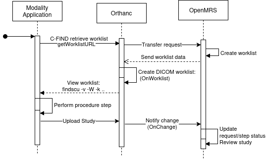
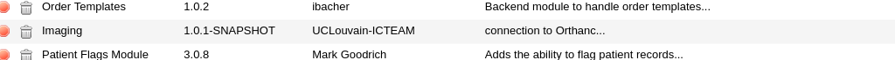
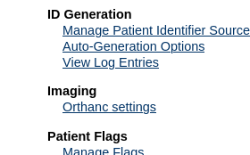

[](https://travis-ci.org/openmrs/openmrs-module-imaging)

OpenMRS CUSTOM Imaging Module

CUSTOMIZED the module for integrating OHIF explorer , medical reports ... for CHU Blida project .

find the original in [here](https://github.com/sadrezhao/openmrs-module-imaging/tree/main) .

======================
In order to improve the management of patient image data within OpenMRS, the open source electronic healthcare system,
we have developed an integration between Orthanc PACS and OpenMRS, initially designed for OpenMRS 2.x, the most widely used version of OpenMRS.
The first release for OpenMRS 3.x is available (## link to npm release 3), the next generation electronic medical record (EMR) system. This new module is focused on
simplifying the management of imaging data.

_CUSTOM_ :
Fixed the Imaging1.1.1-SNAPSHOT branch 04f... orthance url concatenation .

Watch the video demonstration of the module here: [](https://youtu.be/no3WNaq4Q_M)



This diagram illustrates the workflow of the worklist. A radiologist wants to view the worklist generated in OpenMRS via C-FIND Rest API
URL. The Orthanc server forwards the request to OpenMRS. OpenMRS processes the request and returns the worklist in JSON format. The Orthanc plugin function `Onworklsit`
reads the data and generates the worklist in DICOM format. The results can be viewed with the command like `findscu -v -W -k "ScheduledProcedureStepSequence[0].Modality=CT" 127.0.0.1 4242`.
When the radiologist performs the procedure, a new DICOM study is created and uploaded to the Orthanc server. The Orthanc plugin observes the new study using the
OnChange function, notifies OpenMRS to update the worklist status and marks the associated procedure step as completed.

# Preparing Othanc servers

The following is needed:

- An OpenMRS 2 backend server
- One or multiple Orthanc servers

## Deploying the imaging module

**This is a customised fork.** Do not download the upstream release — its artifact does not
contain the OHIF integration or the deletion-reconciliation fix. Build from this directory:

```bash
mvn clean package -DskipTests
```

The artifact is produced at `omod/target/imaging-1.2.0.omod`. With OpenMRS running, upload it
via **Administration → Manage Modules → 'Add or Upgrade Module'**; OpenMRS detects the
installed version and offers an upgrade. The upload may take some time. Keep a copy of the
previously installed `.omod` first — it is the only rollback path, since the artifact is not
in version control:

```bash
docker cp openmrs-app:/usr/local/tomcat/.OpenMRS/modules/<current>.omod ~/
```

If deployed successfully, it should appear in the list of loaded modules on your server:



Deploy OpenMRS Imaging module from it's directory by cloning the repository, navigating to the directory and running the following run command. This will automatically
deploy the module before the server is started. To streamline the process, add the following run configuration to your IDE to efficiently build, deploy and run the project.:

```bash
  mvn clean install openmrs-sdk:run -DserverId=myserver
```

## Configure the connection to the Orthanc servers

You must provide connection settings (IP address, username, etc.) in order to allow OpenMRS to reach the Orthanc server(s). If the imaging module
has been correctly deployed, you can access the connection settings on the administration page of your OpenMRS server:



## Configure your Orthanc servers

The imaging backend module provides an REST API service that the Orthanc servers need to contact to query and update the worklist.
Add the following lines to the configuration file of the Orthanc servers (typically the file `/etc/orthanc/orthanc.json`):

```bash
    "ImagingWorklistURL": "http://OPENMRSHOST:OPENMRSPORT/openmrs/ws/rest/v1/worklist/requests",
    "ImagingUpdateRequestStatus": "http://OPENMRSHOST:OPENMRSPORT/openmrs/ws/rest/v1/worklist/updaterequeststatus",`
    "ImagingWorklistUsername" : "OPENMRSHOSTUSER",`
    "ImagingWorklistPassword" : "OPENMRSHOSTPASSWORD"`
```

Replace OPENMRSHOST and OPENMRSPORT by the address and port of your OpenMRS backend server, and OPENMRSHOSTUSER and OPENMRSHOSTPASSWORD
by the name and password of an user account on the OpenMRS server that you have created for the Orthanc servers.

## Install the worklist plugin on the Orthanc servers:

The Orthanc servers act as worklist servers for the modalities. Our python plugin for Orthanc implements the needed functionality. Download
the python script from https://github.com/sadrezhao/openmrs-module-imaging/blob/main/python/orthancWorklist.py and place it in a directory
that is accessible by the Orthanc servers, for example in `/etc/orthanc`. Then add the following line to the python plugin configuration file
of Orthanc (typically the file `python.json` in `/etc/orthanc`):

```bash
  "PythonScript": "/etc/orthanc/orthancWorklist.py",
```

Then restart the Orthanc server:

```bash
  sudo systemctl restart orthanc
```

## Image Data Management

This is the heart of the Orthanc integration, allowing browsing and viewing of patient images through DICOM viewers available within Orthanc.
The module retrieves the metadata of image studies stored on Orthan servers. A mapping function helps associating OpenMRS patient records with their
corresponding studies. In addition, image data can be uploaded directly from the OpenMRS web client to Orthanc servers.

## Worklist without RIS

In the context of radiology, a worklist is a list of imaging studies or tasks that a radiologist needs to execute, review, or analyze.
These tasks are typically retrieved from a radiology information system (RIS), a specialized database that manages patient and imaging information.
However, in situations where an RIS system is not available or feasible (such as for smaller healthcare facilities, clinics, or specific locations),
a simple radiology worklist can be sufficient.

The Orthanc servers also act as DICOM worklist servers. Imaging procedure requests created in the frontend can be queried by modalities or the
radiology department from the Orthanc servers. When a DICOM study matching the `PerformedProcedureStepID` tag of a worklist procedure step is uploaded
to an Orthanc server, the Orthanc server will notify the OpenMRS server and the status of the procedure step will change in the frontend.

### Testing the worklist

First, create some new imaging requests in the front end. The DCMTK findscu tool from https://support.dcmtk.org/docs/findscu.html allows to query the resulting
DICOM worklists from the Orthanc server (replace 127.0.0.1 by the IP address of the Orthanc server):

```bash
  findscu -v -W -k "ScheduledProcedureStepSequence[0].Modality=CT" 127.0.0.1 4242     # Query by modality

  findscu -v -W -k "PatientID=PatientUuid" 127.0.0.1 4242  # Query by patient data

  findscu -v -W -k "ScheduledProcedureStepSequence[0].RequestedProcedureDescription=xxx" 127.0.0.1 4242 # Query by requested procedure description
```

If you want to generate a `.wl` file, uncomment the following lines from the python plugin:

```bash
# This code only for test:`
  # Save the DICOM buffer to a file`
  # with open("/tmp/worklist_test.wl", 'wb') as f:
  # f.write(responseDicom)`
```

---

# medreport integration (1.1.2-SNAPSHOT)

This module owns **images**, not reports. Report writing, reading, versioning, permissions and
auditing all live in the separate `medreport` module. What this module contributes is two
entry points and one boolean.

### The whole change

| File | Change |
| --- | --- |
| `StudiesPageController` | adds `medreportAvailable = ModuleFactory.isModuleStarted("medreport")` |
| `SeriesPageController` | the same, plus publishes `orthancStudyUID` |
| `studies.gsp` | a banner **above** the studies table linking to `medreport/imagingReports.page` |
| `series.gsp` | the same banner (scoped to the study), plus a per-row document icon that opens medreport's editor on that series |
| `messages*.properties` | one key, `imaging.app.writeReport.label` |

No report logic, no `medreport` dependency in any `pom.xml`, and every addition is wrapped in
`<% if (medreportAvailable) { %>`. **With `medreport` absent, these pages render exactly as
they did before.**

### Why a link and not an embedded panel

An earlier revision embedded medreport's reports panel at the *bottom* of `studies.gsp`. That
failed in two concrete ways: clinicians never scrolled past the studies table to find it, and
it vanished entirely on the "Get studies" navigation. A banner at the top pointing at
medreport's own page fixes both, and the per-series action has a stable target.

### If you edit these GSPs

Groovy's `SimpleTemplateEngine` has **no JSP comment syntax** — `<%-- … --%>` is a parse error
that surfaces as a full-page *UI Framework Error* to the clinician, and a `.gsp` is only
compiled when someone opens the page, so the build will not catch it. Use `<% /* … */ %>`.
`medreport`'s `GspTemplateParseTest` compiles every template in *that* module at build time;
this module has no equivalent, so review template edits carefully.

---

# OHIF integration (1.2.0)

This module owns the **link** to OHIF, not OHIF itself. The viewer is a separate
container fronted by its own reverse-proxy host; see
`../OHIF-Integration-Architecture.md` for the full transport, TLS and authentication
design. What this module contributes is one global property and one icon per study.

### The whole change

| File | Change |
| --- | --- |
| `ImagingConstants` | `GP_OHIF_BASE_URL = "imaging.ohifBaseUrl"` |
| `ImagingProperties` | `getOhifBaseUrl()` reads that global property |
| `config.xml` | declares `imaging.ohifBaseUrl`, default **empty** |
| `StudiesPageController` | publishes `ohifBaseUrl` to the model |
| `SeriesPageController` | the same |
| `SyncStudiesPageController` | the same — **added in 1.2.0** |
| `studies.gsp`, `series.gsp` | OHIF icon between Stone Viewer and Orthanc Explorer |
| `syncStudies.gsp` | the same icon — **added in 1.2.0** |
| `messages.properties`, `messages_pl.properties` | `imaging.app.openOHIFView.label` |
| `resources/images/ohifViewer.png` | the icon |
| `DicomStudyServiceImpl` | prunes studies deleted from Orthanc — **added in 1.2.0** |

The link is built as:

```
<imaging.ohifBaseUrl, trailing slash stripped>/viewer?StudyInstanceUIDs=<studyInstanceUID>
```

Every OHIF addition is wrapped in `<% if (ohifBaseUrl?.trim()) { %>`. **With the
property unset, these pages render exactly as they did before** — which is also why
nothing appears if you deploy the module without configuring it.

## Deployment — one required setting

After installing the `.omod`, set the global property at
**Administration → Maintenance → Settings → Imaging**:

```
imaging.ohifBaseUrl = https://viewer.hospital.lan
```

- No trailing slash (a trailing slash is stripped anyway) and **no leading or trailing
  whitespace** — the guard is `?.trim()`, so a whitespace-only value renders nothing and
  looks identical to not having set it.
- **Set it through the UI, not by SQL.** OpenMRS caches global properties in memory; a
  direct `UPDATE` on `global_property` leaves the running application serving the old
  value, so the button will not appear even though the database looks correct.
- The property is created automatically, empty, when the module starts.

Do **not** confuse this with the **Configuring the Orthanc server** page. That page edits
the `imaging_OrthancConfiguration` table (`orthancBaseUrl`, `orthancProxyUrl`,
credentials) and has nothing to do with OHIF. Changing `orthancBaseUrl` there breaks
uploads and study syncing.

## What 1.2.0 fixes

### 1. Studies deleted from Orthanc kept appearing in "Get studies"

`imaging_DicomStudy` is a **local mirror** of what Orthanc holds, and nothing pruned it:

- `fetchAllStudies(config)` called `createOrUpdateStudy` for every study Orthanc
  returned — create or update only, **never delete**.
- `fetchNewChangedStudies(config)` handles only `NewStudy` and `StableStudy` changes.

Handling a `Deleted` change type would **not** have fixed it. Orthanc's `/changes` log
contains no deletion events at all: change rows are tied to the resource and are removed
along with it. This was confirmed against a live server whose log held only `NewInstance`,
`NewSeries`, `NewStudy`, `StableStudy`, `StablePatient` and `UpdatedAttachment` entries
despite studies having been deleted.

**Reconciliation during a full fetch is therefore the only reliable mechanism.**
`fetchAllStudies(config)` now collects the `StudyInstanceUID`s Orthanc returned and calls
`removeStudiesDeletedFromOrthanc(config, uids)`, which removes local rows for that
configuration whose UID is absent.

> **This deletes patient-assigned records too.** A study removed from the PACS cannot be
> viewed — every link on it 404s — so keeping the row is misleading. Removals are logged:
> `log.info` normally, and **`log.warn`** when the row was assigned to a patient, naming
> the study UID and patient id, so the loss of a clinical association is auditable. If
> your site needs assigned studies preserved, change `removeStudiesDeletedFromOrthanc`
> to skip rows where `getMrsPatient() != null`.

Scope: only the configuration being fetched, so a multi-Orthanc setup will not have one
unreachable server prune another's studies. Nothing in the schema references
`imaging_DicomStudy`, so removal has no cascade effects.

The incremental poller (`fetchNewChangedStudies`) is unchanged and still cannot see
deletions — **"Get studies" is what reconciles them.**

### 2. The OHIF icon was missing on the "Get studies" page

Two independent omissions, both required:

- `SyncStudiesPageController.get()` never called
  `model.addAttribute("ohifBaseUrl", ...)`, unlike the studies and series controllers.
- `syncStudies.gsp` had no OHIF markup at all.

The icon appeared on a patient's own studies but vanished on studies fetched from the
PACS. Both are fixed, matching the existing pages exactly.

### If you edit these GSPs

Groovy's `SimpleTemplateEngine` has **no JSP comment syntax** — `<%-- … --%>` is a parse
error that surfaces as a full-page *UI Framework Error*, and a `.gsp` is compiled only
when someone opens the page, so the build will not catch it. Use `<% /* … */ %>`.

`syncStudies.gsp` uses **CRLF** line endings while the Java sources use LF. Preserve
them; a mixed-ending file produces confusing diffs.

The build runs `maven-java-formatter-plugin`, which **rewrites sources in place**. Expect
your formatting to be normalised, and re-read files after a build before diffing.

# Patient-match confidence scoring (1.3.0)

Every study fetched from Orthanc ("Get studies") is unassigned to any patient by design (see
`createOrUpdateStudy` — `mrsPatient` is always `null` on create). Linking a study to the right
patient has always been a **manual step** on `syncStudies.gsp`, guided only by a bare fuzzy
name-similarity percentage in a "Match" column, with no default sort, no default filter, and a
checkbox that submits immediately with no confirmation. On a page listing every study in the whole
system, a percentage a few pixels away from the wrong row is an easy misclick — e.g. mistaking an
80% match on Patient B for the 99% match on Patient A one row above/below it.

This change makes that percentage more trustworthy and easier to read at a glance. It does **not**
by itself add the confirmation step, default sort/filter, or "already assigned to another patient"
warning discussed for the same problem — see "What this does not do yet" below.

## The whole change

| File | Change |
| --- | --- |
| `DicomStudy`, `DicomStudy.hbm.xml`, `liquibase.xml` (changeset `302`) | new `dicomPatientId` / `patientBirthDate` columns, populated from the DICOM PatientID (0010,0020) / PatientBirthDate (0010,0030) tags |
| `api/pom.xml` | added the `fuzzywuzzy` dependency (name-similarity scoring moved from `omod` into the `api` service layer, see below) |
| `api/.../api/match/` (new package) | `IdentityMatch`, `MatchTier`, `MatchThresholds`, `MatchScoreCalculator` — framework-independent scoring/tiering logic |
| `ImagingConstants` | 4 new global property keys, `GP_MATCH_THRESHOLD_*` |
| `ImagingProperties` | `getMatchThresholds()`, with safe fallback to defaults on missing/invalid configuration |
| `DicomStudyService` / `DicomStudyServiceImpl` | new `computeMatchScore(Patient, DicomStudy)`, replacing the two duplicated `FuzzySearch.tokenSetRatio(...)` call sites that used to live directly in the controllers |
| `SyncStudiesPageController`, `DicomStudyController` (`/studiesbyconfig`) | call the new service method instead of `FuzzySearch` directly; both now also expose a `MatchTier` per study |
| `StudiesWithScoreResponse`, `DicomStudyResponse` | REST responses now include `tiers` and the two new DICOM fields |
| `config.xml` | 4 new global properties, defaults `95` / `75` / `50` / `25` |
| `syncStudies.gsp` | new "Confidence" column showing a colored tier badge next to the raw percentage |
| `messages.properties`, `messages_fr.properties` | tier labels and the new column header |

### How the score is computed

`DicomStudyServiceImpl.computeMatchScore(patient, study)`:

1. A fuzzy name-similarity score (0-100) between `patient.givenName + " " + patient.familyName` and
   `study.getPatientName()`, exactly as before (`FuzzySearch.tokenSetRatio`, unchanged).
2. Compares `study.getDicomPatientId()` against **every** identifier OpenMRS has for the patient:
   the preferred identifier's UUID (this module's own worklist generation writes the identifier
   **UUID**, not the plain value, into the DICOM PatientID tag — see `RequestProcedureController`),
   the preferred identifier's plain value, and every other identifier's plain value. This is an
   `IdentityMatch`: `MATCH`, `MISMATCH`, or `UNKNOWN` if the DICOM tag is empty.
3. Compares `study.getPatientBirthDate()` (raw DICOM `yyyyMMdd`) against `patient.getBirthdate()`,
   the same three-way way.
4. Combines them (`MatchScoreCalculator.computeScore`):
   - An identifier `MATCH` is treated as conclusive and forces the score to **100**, regardless of
     the name score or the birthdate.
   - Otherwise, start from the name score, subtract **40** for an identifier `MISMATCH` (two
     different real people can share a name; they should not share an identifier), add **5** for a
     birthdate `MATCH`, subtract **15** for a birthdate `MISMATCH`.
   - `UNKNOWN` never changes the score. Older studies fetched before this change have no
     `dicomPatientId`/`patientBirthDate` yet, so they score exactly as they did before, until their
     next "Get studies" backfills the two new fields (see below).
   - Result is always clamped to `[0, 100]`.

These adjustment constants (`ID_MISMATCH_PENALTY`, `DOB_MATCH_BONUS`, `DOB_MISMATCH_PENALTY`) are
plain constants in `MatchScoreCalculator`, not global properties — only the 4 tier thresholds were
asked to be admin-configurable. Tune them there if needed.

### The 6 confidence tiers

| Tier | Color | Band (default thresholds) |
| --- | --- | --- |
| Highest | blue | *relative*, see below |
| Very High | dark green | score ≥ `imaging.matchThreshold.veryHigh` (95) |
| High | green | score ≥ `imaging.matchThreshold.high` (75) |
| Medium | yellow | score ≥ `imaging.matchThreshold.medium` (50) |
| Low | red | score ≥ `imaging.matchThreshold.low` (25) |
| Very Low | dark red | score below the Low threshold |

**"Highest" is relative, not absolute.** `MatchScoreCalculator.classify(scoresByKey, thresholds)`
looks at every score being displayed together (e.g. every study on one patient's sync page) and
marks whichever one (or, in a tie, ones) has the *highest* score in that specific list as
"Highest" — overriding whatever absolute band it would otherwise fall into. If every candidate is a
poor match, the least-bad one is still labelled "Highest". **The raw percentage is always shown
next to the badge for exactly this reason** — do not remove it, and do not treat "Highest" alone as
a green light.

As a guard against a degenerate case (e.g. a page full of studies with no captured patient name at
all, all scoring 0), "Highest" is only applied when the maximum score in the list is strictly
greater than 0; otherwise every row falls back to its plain "Very Low" band instead of every single
row misleadingly reading "Highest".

## Deployment

The 4 thresholds are ordinary global properties, editable at
**Administration → Maintenance → Settings → Imaging**:

```
imaging.matchThreshold.veryHigh = 95
imaging.matchThreshold.high     = 75
imaging.matchThreshold.medium   = 50
imaging.matchThreshold.low      = 25
```

They must be a strictly decreasing sequence in `[0, 100]` (`veryHigh > high > medium > low >= 0`).
`ImagingProperties.getMatchThresholds()` never throws: if any value is missing, non-numeric, or the
4 values are not in a valid order, it logs a `warn` and **falls back to the full default set**
(95/75/50/25) rather than applying a partial fix — a half-corrected, still-invalid ordering would
be worse than obviously-wrong defaults.

The two new `imaging_DicomStudy` columns are added by `liquibase.xml` changeset `302`,
which runs automatically the next time the module starts — no manual DB step needed. Existing rows
get `dicomPatientId`/`patientBirthDate` backfilled the next time "Get studies" runs, **only** if the
row doesn't already have a value (see the comment in `createOrUpdateStudy`); this is a deliberate,
narrow exception to this codebase's existing "DICOM studies are immutable" handling, made only for
fields that could not have been captured before this change existed.

## What this does not do yet

This is scoring/display only. It does not yet:
- Default-sort or default-filter the "Get studies" list by score (it's still every study in the
  system, in whatever order the DB returns it).
- Ask for confirmation before assigning a study, regardless of tier.
- Show which patient a study is *currently* assigned to before you reassign it.
- Enforce anything server-side — a REST client can still call `/assingstudy` with a Very-Low-tier
  study and no override reason.

These were scoped as later phases of the same "prevent the misclick" plan and are not implemented
here.

# Translation encoding fix & status-message i18n (1.3.0)

## Accented characters rendering as "unknown character" boxes

`messages_fr.properties`, `messages_de.properties`, `messages_es.properties` and
`messages_it.properties` were saved on disk as **ISO-8859-1 (Latin-1)**, not UTF-8, most likely by
a translator's editor defaulting to that encoding. OpenMRS's module message loader reads
`.properties` resources as UTF-8. A Latin-1 accented character is a single byte (e.g. `é` is
`0xE9`), which is **not a valid standalone UTF-8 byte** (`0xE9` starts a 3-byte UTF-8 sequence that
never gets completed), so the JVM's UTF-8 decoder replaces it with U+FFFD, the "unknown character"
replacement glyph — exactly the boxes reported.

This was confirmed byte-for-byte, not guessed: decoding each file strictly as UTF-8 raised
`UnicodeDecodeError: invalid continuation byte` at the position of every accented character, and
re-decoding the same bytes as ISO-8859-1 produced perfectly correct French/German/Spanish/Italian
text.

**Fix:** all 4 files were re-encoded from ISO-8859-1 to UTF-8 — the text content is byte-for-byte
unchanged in meaning, only the encoding of the file itself changed, so every existing translation
now round-trips correctly. `messages.properties` (English) and `messages_pl.properties` (Polish)
were already valid UTF-8 (the Polish file has no accented characters in its current translations)
and were left untouched. No BOM was introduced (OpenMRS/Java property loaders do not expect one).

> If you add or edit any of these 4 files, **save as UTF-8, not your editor's system default** —
> this is what caused the original bug.

*(Pre-existing and unrelated: `messages_fr.properties` has a typo, "Accun seveur Orthanc configuré"
for `imaging.app.none` - should read "Aucun serveur Orthanc configuré". Left as-is since it's a
wording issue, not an encoding one, and wasn't part of what broke here.)*

## Status messages were English-only and always shown in red

`StudiesPageController` (`uploadStudy`, `syncStudy`, `deleteStudy`, and the
`MaxUploadSizeExceededException` handler) built its user-facing status message as a **plain,
hardcoded English `String`**, passed as a `message` redirect attribute and echoed verbatim by
`studies.gsp` / `syncStudies.gsp` inside a hardcoded `color:red` `<div>`:

```gsp
<div style="color:red;">
${param["message"]?.getAt(0) ?: ""}
</div>
```

Two independent problems followed directly from this:
- The text was never translated — it bypassed `ui.message()` entirely, unlike everything else in
  these pages — so it stayed in English regardless of the user's locale.
- It was **always red**, including "Studies successfully fetched" and "All files uploaded" - a
  success is not supposed to look like an error.

### The whole change

| File | Change |
| --- | --- |
| `StudiesPageController` | every message is now a **message key** (e.g. `imaging.studies.fetch.success`) plus a `messageType` (`"success"` / `"error"`) redirect attribute; the two messages with dynamic content (`upload.partial`, `study.delete.error`) also pass `messageArg0`/`messageArg1` |
| `studies.gsp`, `syncStudies.gsp` | resolve the key via `ui.message(key)` (or `ui.message(key, args)` when args are present) and pick `green` for `"success"` / `red` for anything else; render nothing when there is no message |
| `messages.properties`, `messages_fr.properties` | the 9 new keys, in English and French |

Mapping of every message this touches:

| Key | Type | English | French |
| --- | --- | --- | --- |
| `imaging.studies.fetch.success` | success | Studies successfully fetched | Études récupérées avec succès |
| `imaging.studies.fetch.error` | error | Not all studies could be downloaded successfully... | Certaines études n'ont pas pu être téléchargées... |
| `imaging.studies.upload.none` | error | No files to upload | Aucun fichier à envoyer |
| `imaging.studies.upload.all` | success | All files uploaded | Tous les fichiers ont été envoyés |
| `imaging.studies.upload.partial` | error | Some files could not be uploaded. {0} of {1} files uploaded. | Certains fichiers n'ont pas pu être envoyés. {0} sur {1} fichiers envoyés. |
| `imaging.studies.upload.maxSizeExceeded` | error | File size exceeds maximum upload limit... | La taille du fichier dépasse la limite autorisée... |
| `imaging.study.delete.success` | success | Study successfully deleted | Étude supprimée avec succès |
| `imaging.study.delete.error` | error | Deletion of study failed. Reason: {0} | Échec de la suppression de l'étude. Raison : {0} |
| `imaging.study.delete.denied` | error | Permission denied... | Autorisation refusée... |

`imaging.studies.upload.none` (nothing was selected) is classified `"error"` rather than
`"success"`, matching its original always-red presentation - nothing was actually accomplished, so
green would be misleading.

### A note on the two messages with dynamic content

`imaging.studies.upload.partial` and `imaging.study.delete.error` use `{0}`/`{1}` placeholders
resolved via `ui.message(key, args)`, i.e. `java.text.MessageFormat`. **Any literal apostrophe in a
message that has placeholders must be doubled (`''`)**, or `MessageFormat` will misparse it as the
start of a quoted literal — this is why the French text reads `n''ont` and `l''étude` in the
`.properties` file for these two keys specifically, while every apostrophe in a plain, no-argument
message (e.g. `n'ont` in `imaging.studies.fetch.error`) is left as a single `'`. Get this backwards
in either direction and the rendered text is wrong - either a stray double-apostrophe (over-escaped)
or a swallowed word (under-escaped, on any message that does have arguments).

## Version bump

This release, encompassing the patient-match confidence scoring above and both fixes in this
section, is `1.3.0`. Updated in `pom.xml`, `api/pom.xml` and `omod/pom.xml` (module version and the
`imaging-api` inter-module dependency version); `config.xml`'s `<version>` is
`${project.parent.version}` and picks this up automatically at build time.
